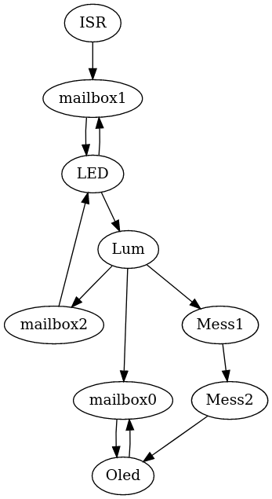

# TP4 : Programmation Arduino

Avec une version plus récente de l'IDE arduino l'upload avec le processeur `ATmega328` produisait l'erreur suivante :

    avrdude: stk500_recv(): programmer is not responding
    avrdude: stk500_getsync() attempt 1 of 10: not in sync: resp=0x00

Il nous a fallu selectionner le processeur `ATmega328p (old bootloader)` pour que le programme puisse être uploadé correctement.

## Questions :
* WaitForTime est un tableau de timers, un pour chaque tâche périodique.

* Même si deux tâches ont la même période, elles s'éxecutent séparément, à des dates précises. Celà grâce aux timers atttribués à chacunes des tâches.

* Le nom de la boîte à lettre est "mb0"; state est initialisé à 'EMPTY', tandis que val n'est pas initialisé.

