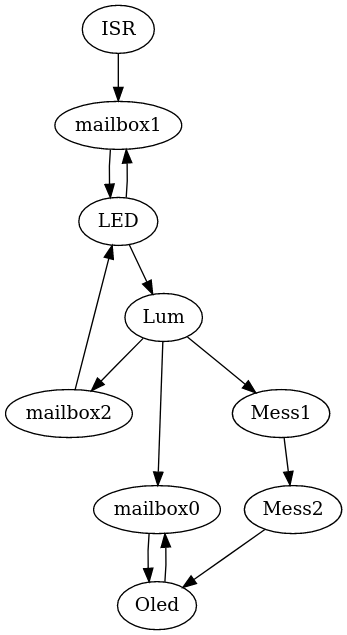

# TP4 : Programmation Arduino 

## Questions :
* WaitForTime est un tableau de timers, un pour chaque tâche périodique.

* Même si deux tâches ont la même période, elles s'éxecutent séparément, à des dates précises. Celà grace au timers atttribués à chacunes des tâches.

* Le nom de la boîte à lettre est "mb0"; state est initialisé à 'EMPTY', tandis que val n'est pas initialisé.

